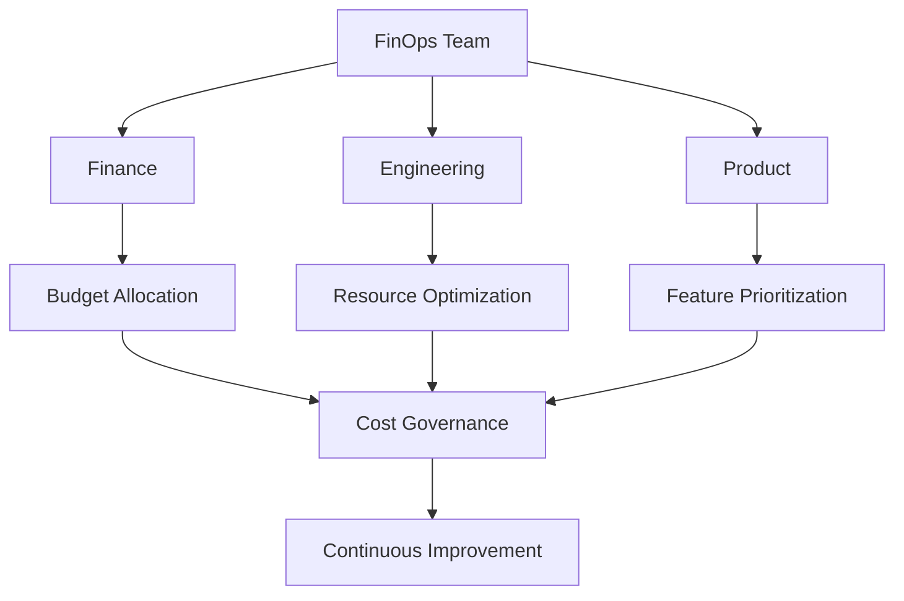
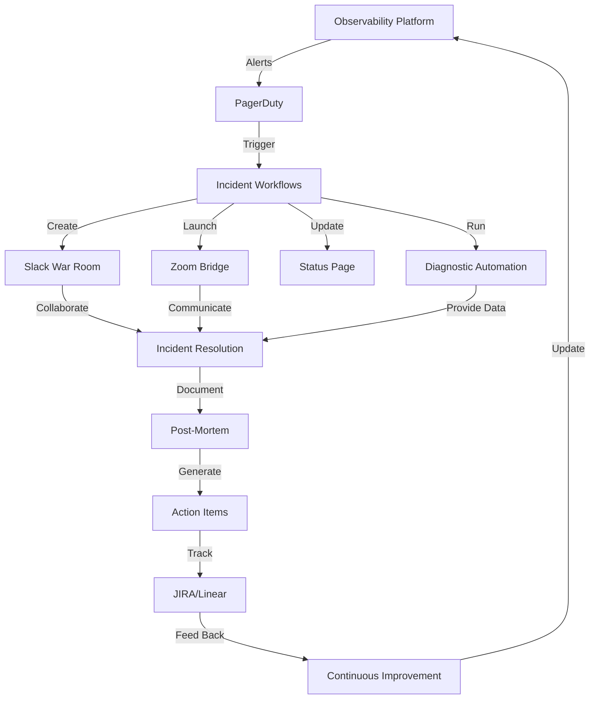

# Phase 7D: Multilingual Research on Latest Observability Best Practices (2024)

**Research Date:** November 20, 2024
**Languages Covered:** English, Japanese (日本語), Chinese (中文)
**Focus Areas:** Trace Sampling, Data Consistency, Cost Tracking, Disaster Recovery, Incident Management

---

## Executive Summary

This comprehensive research covers the latest 2024 developments across five critical observability domains, drawing from English, Japanese, and Chinese sources. Key findings reveal significant industry shifts toward AI-driven automation, cost optimization frameworks, and OpenTelemetry standardization.

### Major 2024 Trends
1. **Jaeger v2 Release** (November 2024): Complete OpenTelemetry integration
2. **Grafana Labs Acquisition of TailCtrl** (September 2024): Adaptive trace sampling
3. **FOCUS v1.1 Release** (November 2024): Multi-cloud cost standardization
4. **OpenTelemetry Weaver**: Design-time validation for semantic conventions
5. **AI-Powered Incident Management**: GenAI integration across major platforms

---

## 1. Trace Sampling (トレースサンプリング / 跟踪采样)

### Latest Developments

#### Grafana Labs Acquires TailCtrl (September 2024)
**Key Innovation:** Adaptive trace sampling using machine learning
- **Technology:** OTLP support with ML-driven trace selection
- **Value Proposition:** Automatically identifies and retains valuable traces
- **Integration:** Part of Grafana's Adaptive Telemetry suite (Adaptive Metrics, Adaptive Logs, Adaptive Traces)
- **Status:** Research phase, targeting cost optimization
- **Impact:** Transforms enormous data volumes into simplified trace streams for anomaly detection and root cause analysis

#### Jaeger v2 Released (November 2024)
**Architectural Revolution:** OpenTelemetry Collector at the core
- **Major Changes:**
  - Single binary deployment (down from multiple binaries in v1)
  - Container image size: 40MB → 30MB
  - Native OTLP support
  - Extended with Jaeger-specific features
  - Configuration via YAML for different deployment roles
- **Community Impact:** 2nd most active CNCF project after Kubernetes
- **Migration Path:** Seamless upgrade from v1 with maintained backward compatibility

#### Sampling Strategies Comparison (2024)

| Strategy | Use Case | Resource Requirements | Best For |
|----------|----------|----------------------|----------|
| **Head-based Sampling** | Default for most systems | Low (decision at trace start) | Simple, predictable sampling |
| **Tail-based Sampling** | Advanced diagnostics | High (30s memory buffer, 100-1000s GB RAM) | Error traces, high-latency detection |
| **Adaptive Sampling** | Dynamic environments | Medium-High (ML processing) | Cost optimization, traffic pattern adaptation |
| **Probabilistic Sampling** | Baseline coverage | Low | Consistent sampling percentage |

#### Research: Astraea - Online Probabilistic Distributed Tracing (2024)
**Published:** IC2E 2024, IBM Research
**Key Findings:**
- Combines online Bayesian learning with multi-armed bandit frameworks
- Localizes performance variations using only 20-35% of instrumentation
- Significantly reduces tracing overhead, storage, and compute costs
- Addresses trade-off between tracing cost and diagnostic utility

#### Research: TraceMesh - Scalable Streaming Sampling (2024)
**Published:** arXiv 2024
**Innovation:**
- Employs Locality-Sensitivity Hashing for improved sampling efficiency
- Dynamic clustering that adjusts sampling to avoid over-sampling recurring traces
- Streaming approach for real-time trace processing

#### Research: TraceWeaver (SIGCOMM 2024)
**Breakthrough:** Distributed tracing WITHOUT application modification
- Traditional approach requires instrumenting every component
- TraceWeaver reconstructs traces using readily available production data (timestamps, call graphs)
- Eliminates instrumentation overhead entirely

### Best Practices (2024)

#### 1. Blended Sampling Strategy
```yaml
# Recommended approach combining multiple strategies
tail_sampling:
  policies:
    - name: error-traces
      type: status_code
      config:
        error_codes: [500, 503, 504]
      sample_rate: 100%  # Always capture errors

    - name: high-latency
      type: latency
      config:
        threshold_ms: 5000
      sample_rate: 100%

    - name: baseline
      type: probabilistic
      config:
        sampling_percentage: 5  # 5% of normal traces
```

#### 2. Resource Planning
- **Small deployments:** Head-based sampling (< 1000 traces/sec)
- **Medium deployments:** Tail-based sampling with 100-500GB RAM cluster
- **Large deployments:** Adaptive sampling with ML-driven decisions (> 10K traces/sec)

#### 3. Cost Optimization
- Netflix reduced observability costs from 25% (2012) to < 5% (2024) of AWS bill
- Streaming analytics vs. store-then-query approach
- Target: 20-35% instrumentation coverage for full diagnostic capability

### Tools Comparison

#### Tempo vs. Jaeger (2024 Update)

| Feature | Grafana Tempo | Jaeger v2 | Winner |
|---------|---------------|-----------|--------|
| **Storage Backend** | Blob stores (S3, GCS) - cheaper | Cassandra, Elasticsearch - higher maintenance | Tempo |
| **Cost** | Lower (object storage) | Higher (database maintenance) | Tempo |
| **Community Size** | Smaller, growing | Larger, CNCF graduated | Jaeger |
| **Integration** | Grafana ecosystem (unified metrics/logs/traces) | Standalone UI, now OTel-based | Tempo for ecosystems |
| **Architecture** | Lightweight, decentralized Grafana Agents | OTel Collector framework | Tie (both modern) |
| **Maturity** | Released 2020 | Released 2015, v2 in 2024 | Jaeger |
| **Indexing** | No traditional indexing, direct object storage | Collectors handle indexing | Depends on use case |
| **Search** | TraceQL query language | Sophisticated trace search UI | Tie |

**Recommendation:**
- **Choose Tempo if:** You're already in Grafana ecosystem, need cost optimization, prefer simpler ops
- **Choose Jaeger if:** You need mature tooling, extensive community support, standalone tracing solution

### Japanese Research Findings (日本語)

**クックパッドの分散トレーシング実装** (Cookpad's Distributed Tracing)
- OpenTelemetry adoption for microservices monitoring
- Focus on head-based sampling for cost control
- Integration with Japanese cloud providers

**食べログの可変レート分散トレーシング** (Tabelog's Variable-Rate Distributed Tracing)
- Large-scale service adaptive sampling
- Dynamic sampling rate adjustment based on traffic patterns
- Real-world implementation at scale

**New Relic日本語ドキュメント** (2024年3月)
- Head-based sampling as default approach
- Recommendation for tail-based sampling in critical production systems

### Implementation Checklist

- [ ] Evaluate trace volume and determine sampling strategy
- [ ] Start with head-based sampling for immediate cost control
- [ ] Plan tail-based sampling infrastructure if error diagnostics are critical
- [ ] Consider adaptive sampling for AI/ML workloads with unpredictable patterns
- [ ] Implement Jaeger v2 or Tempo based on ecosystem fit
- [ ] Set up OpenTelemetry Collector as central sampling point
- [ ] Monitor sampling effectiveness: capture rate vs. diagnostic capability
- [ ] Establish SLOs for trace retention and search performance

---

## 2. Data Consistency Verification (データ一貫性検証 / 数据一致性验证)

### Latest Developments

#### OpenTelemetry Weaver (2025 Preview, announced late 2024)
**Status:** CLI v0.16.1, production-ready
**Purpose:** Design-time validation and consistency enforcement

**Key Features:**
1. **Schema Management:** Define, validate, and evolve telemetry schemas
2. **Validation Commands:**
   - `weaver registry check` - Validate schema correctness
   - `weaver registry diff` - Compare schema versions
   - `weaver registry live-check` - Runtime compliance verification
3. **CI/CD Integration:** Automated quality gates for observability data
4. **Code Generation:** Auto-generate constants and helpers in native SDK languages
5. **Documentation:** Human-readable docs generated from schemas

**Validation Example:**
```bash
# Validate semantic conventions compliance
weaver registry live-check \
  --schema ./semconv.yaml \
  --endpoint http://localhost:4318

# Detect issues:
# - Wrong attribute types
# - Missing required attributes
# - Naming conflicts
# - Type mismatches
```

#### OpenTelemetry Semantic Conventions v1.38.0 (2024)

**Coverage Areas (2024 Expansion):**
- General operations
- CI/CD systems ⭐ NEW (2024 focus)
- Cloud Providers
- CloudEvents
- GraphQL
- HTTP (stable conventions)
- Messaging
- Object Stores
- RPC operations
- Database observability ⭐ (improved consistency across signals)
- Profiling ⭐ NEW (announced March 2024)

**Migration Support:**
```bash
# Opt-in to stable HTTP semantic conventions
export OTEL_SEMCONV_STABILITY_OPT_IN=http

# Dual emission for gradual migration
export OTEL_SEMCONV_STABILITY_OPT_IN=http/dup
```

### Data Consistency Challenges (2024 Research)

#### Key Research Findings

**1. Cardinality Management**
- **Challenge:** Data consistency complications from high-cardinality metrics
- **Impact:** 23% year-over-year data growth
- **Solution:** High-cardinality observability with proper dimensionality
- **Best Practice:** Extensive filtering capabilities + correlation discovery

**2. Mixed Telemetry Formats**
- **Problem:** Each system component emits unique telemetry formats
- **Impact:** Continuous streams of mixed signals for SREs
- **Solution:** OpenTelemetry's unified OTLP format
- **Result:** Consistent, correlated, and portable telemetry data

**3. MTTR Correlation Research (November 2024)**
**Paper:** "Correlation Between Observability Metrics and Mean Time to Recovery (MTTR) in SRE"
**Key Findings:**
- MTTR most reduced by: Fast incident detection + exhaustive low-cardinality instrumentation
- Discoverable diagnostic narratives in traces and logs critical
- Consistency in data format directly impacts recovery speed

#### Observability Platform Assessment (2024)

**Data Quality Concerns Being Addressed:**
1. **Cardinality Shifts** - Monitoring for unexpected metric explosions
2. **Mismatched Types** - Type consistency across telemetry signals
3. **Missing Attributes** - Completeness validation
4. **Naming Inconsistencies** - Standardized attribute naming

### Best Practices for Data Consistency

#### 1. Implement Semantic Conventions

```yaml
# Example: Database observability with semantic conventions
instrumentation:
  database:
    attributes:
      # Consistent across PostgreSQL, MySQL, MongoDB
      - db.system              # e.g., "postgresql", "mysql"
      - db.connection_string   # Connection identifier
      - db.user               # Database user
      - db.name               # Database name
      - db.statement          # SQL query (if applicable)
      - db.operation          # Operation type (SELECT, INSERT, etc.)

    metrics:
      - db.client.connections.usage
      - db.client.connections.max
      - db.client.operation.duration
```

**Benefit:** Switch from Postgres to MySQL or Node to Java - core data structure stays the same.

#### 2. Use Consistent Tagging

```yaml
# Standard resource attributes across all services
resource:
  attributes:
    - service.name: "payment-service"
    - service.namespace: "production"
    - service.version: "v2.3.1"
    - deployment.environment: "prod-us-east-1"
    - k8s.cluster.name: "prod-cluster-01"
    - k8s.namespace.name: "payments"
    - k8s.pod.name: "${POD_NAME}"
    - cloud.provider: "aws"
    - cloud.region: "us-east-1"
    - cloud.availability_zone: "us-east-1a"
```

#### 3. Policy-Based Validation

**Using Rego Policies for Custom Validation:**
```rego
# Example: Enforce organization-specific invariants
package observability.validation

# Rule: All HTTP spans must have http.status_code
deny[msg] {
  input.kind == "SPAN_KIND_SERVER"
  input.attributes["http.method"]
  not input.attributes["http.status_code"]
  msg := "HTTP server spans must include http.status_code attribute"
}

# Rule: Database spans must have db.system
deny[msg] {
  input.attributes["db.statement"]
  not input.attributes["db.system"]
  msg := "Database spans must specify db.system attribute"
}
```

#### 4. Cross-Signal Correlation

**Unified Context Propagation:**
```python
# Python example: Correlating logs, metrics, and traces
from opentelemetry import trace, metrics
from opentelemetry.sdk.resources import Resource
import logging

# Shared resource attributes
resource = Resource.create({
    "service.name": "payment-service",
    "service.version": "1.0.0",
})

# Configure tracer
tracer = trace.get_tracer(__name__)

# Configure logger with trace context
logging.basicConfig(format='%(asctime)s [trace_id=%(otelTraceID)s span_id=%(otelSpanID)s] %(message)s')

# In request handler
with tracer.start_as_current_span("process_payment") as span:
    span.set_attribute("payment.amount", 100.00)
    span.set_attribute("payment.currency", "USD")

    # Log with automatic trace context injection
    logging.info("Processing payment")

    # Metric with same attributes
    payment_counter.add(1, {
        "payment.currency": "USD",
        "payment.status": "success"
    })
```

### Japanese Research (日本語) - 2024 Observability Trends

**New Relic 2024 オブザーバビリティ予測レポート** (日本語版)
- AI/MLによる一貫性検証の重要性増加
- OpenTelemetry採用の加速
- マルチクラウド環境でのデータ一貫性課題

**AWS 春・秋の Observability 祭り 2024**
- 生成AIを活用した障害分析支援アセット「Failure Analysis Assistant (FA2)」
- AWS Lambda + Amazon Bedrock によるLLM分析
- データ一貫性がAI分析の精度に直結

### Chinese Research (中文) - Observability Data Consistency

**可信数据空间发展行动计划（2024—2028年）**
- Focus on trusted data spaces for consistent data flow
- Target: 100+ trusted data spaces by 2028 in China
- Emphasis on data consistency in distributed systems

**可观测性三要素一致性**
- Logs (日志), Traces (追踪), Metrics (度量)
- Elastic Stack for log collection
- Prometheus as de facto standard for metrics
- OpenTelemetry for unified approach

### Industry Standards Adoption (2024)

| Platform | OpenTelemetry Support | Semantic Conventions | Data Consistency Features |
|----------|----------------------|---------------------|--------------------------|
| Datadog | Full OTLP support | Custom + OTel | Auto-tagging, unified context |
| New Relic | Full OTLP support | Full support | Intelligent correlation |
| Dynatrace | Full OTLP support | Full support | Auto-discovery, unified model |
| Elastic | Full OTLP support | Full support | ECS + OTel mapping |
| Grafana | Full OTLP support | Full support | Unified data model |

### Implementation Checklist

- [ ] Adopt OpenTelemetry SDKs across all services
- [ ] Implement semantic conventions v1.38.0+
- [ ] Set up OpenTelemetry Weaver for CI/CD validation
- [ ] Define organization-specific Rego policies
- [ ] Establish consistent resource attributes across all telemetry
- [ ] Enable OTLP export from all instrumentation
- [ ] Implement trace context propagation in logs
- [ ] Set up automated schema validation in CI/CD
- [ ] Monitor data quality metrics (completeness, cardinality, type consistency)
- [ ] Create data consistency SLOs and dashboards

---

## 3. Cost Tracking & Chargeback (コスト追跡と請求 / 成本追踪和计费)

### Latest Developments

#### FOCUS v1.1 Released (November 2024)
**Full Name:** FinOps Open Cost and Usage Specification
**Governance:** FinOps Foundation

**Version Timeline:**
- **v1.0 (June 2024):** GA release with AWS, Azure, GCP, OCI support
- **v1.1 (November 2024):** Enhanced multi-cloud support, granular analysis
- **v1.2 (Expected June 2025):** SaaS concepts support

**Cloud Provider Support:**
- Amazon Web Services (AWS) ✅
- Microsoft Azure ✅
- Google Cloud Platform (GCP) ✅
- Oracle Cloud Infrastructure (OCI) ✅
- Alibaba Cloud ✅
- Tencent Cloud ✅

**Key Features:**
- Uniform cost and usage datasets across cloud vendors
- First-time capability to merge billing data without proprietary normalization
- Standardized columns for granular multi-cloud analysis

#### Kubecost Milestones (2024)

**10 Million Installs Milestone** (2024)
- Market Leadership: 23% adoption rate in Kubernetes cost monitoring
- Enterprise customers achieving 40-45% AWS spending reduction

**Version 2.4: NVIDIA GPU Cost Monitoring**
- AI/ML workload cost tracking
- GPU resource allocation and utilization
- Cost optimization for training and inference workloads

**Version 2.2: Carbon Cost Monitoring**
- Environmental impact tracking
- Carbon footprint measurement per workload
- Sustainability reporting integration

#### OpenCost vs. Kubecost (2024 Comparison)

| Feature | OpenCost | Kubecost | Advantage |
|---------|----------|----------|-----------|
| **License** | Apache 2.0, fully open source | Commercial + open core | OpenCost (openness) |
| **CNCF Status** | Sandbox project | N/A (commercial) | OpenCost (governance) |
| **Cost Precision** | Basic allocation | Most accurate, detailed | Kubecost |
| **Pricing Details** | No discounts, spot, RI accounting | Full pricing intelligence | Kubecost |
| **Multi-Cloud** | Kubernetes-focused | AWS, Azure, GCP, on-prem | Kubecost |
| **Forecasting** | Basic | Advanced with ML | Kubecost |
| **Anomaly Detection** | Limited | Comprehensive | Kubecost |
| **Installation** | Manual setup | Production-ready Helm chart | Kubecost |
| **Support** | Community | Enterprise SLA available | Kubecost |
| **Cost** | Free forever | Free tier + paid plans | OpenCost (cost) |

**Recommendation:**
- **OpenCost:** Startups, basic K8s cost tracking, CNCF governance preference
- **Kubecost:** Enterprises, multi-cloud, need for accurate chargeback/showback

### Showback vs. Chargeback Strategies (2024)

#### Showback Approach
**Definition:** Departments receive detailed reports on IT resource consumption without financial accountability

**Advantages:**
- Easier adoption (no financial system changes)
- Promotes awareness and transparency
- Educational phase before chargeback
- No budget pressure, focuses on understanding

**Best For:**
- Organizations new to cost allocation
- Cultural transformation initiatives
- Pilot programs before full chargeback
- DevOps teams learning cost optimization

#### Chargeback Approach
**Definition:** Direct allocation and billing of cloud costs to consuming departments/projects

**Advantages:**
- Financial accountability drives optimization
- Direct link to departmental budgets
- Incentivizes waste reduction
- Measurable ROI for optimization efforts

**Best For:**
- Mature cloud organizations
- Budget-constrained environments
- Cross-departmental cloud usage
- Organizations with strong FinOps practices

#### Hybrid Model (2024 Best Practice)
```yaml
# Progressive FinOps Maturity Model
Phase 1 (Months 1-3):
  - Showback only
  - Build cost visibility
  - Educate teams
  - Establish baseline

Phase 2 (Months 4-6):
  - Continue showback
  - Soft chargeback (no budget impact)
  - Set cost optimization goals
  - Implement tagging strategy

Phase 3 (Months 7-9):
  - Partial chargeback (non-production)
  - Production remains showback
  - Refine allocation rules
  - Optimize high-cost workloads

Phase 4 (Months 10-12):
  - Full chargeback
  - Budget enforcement
  - Continuous optimization
  - FinOps culture established
```

### Real-World Case Studies (2024)

#### Case Study 1: Fortune 500 Company (Kubecost)
**Industry:** Financial Services
**Challenge:** Lack of visibility into Kubernetes costs across 50+ clusters

**Implementation:**
- Deployed Kubecost across all AWS EKS clusters
- Automated deployment using Terraform
- Integrated with AWS Cost Explorer
- Enabled chargeback per business unit

**Results:**
- Identified $1M in annualized savings within 4 months
- 40% reduction in Kubernetes operating costs
- 100% coverage in resource tagging
- 90% elimination of redundant cloud consumption

#### Case Study 2: Astronomer (Chronosphere)
**Industry:** Data Orchestration
**Challenge:** Explosive observability data growth, unsustainable costs

**Implementation:**
- Migrated to Chronosphere from legacy observability platform
- Implemented Observability Data Optimization Cycle
- Set up team-level quotas and limits

**Results:**
- 80% reduction in observability data volumes
- 84% average data volume reduction (Chronosphere customers)
- Significant cost savings while improving visibility
- Improved developer productivity and query performance
- Enabled chargeback per development team

#### Case Study 3: Netflix (Internal Custom Tools)
**Industry:** Streaming Media
**Challenge:** Understanding resource usage across massive AWS infrastructure

**Evolution:**
- 2012: Observability = 25% of AWS bill
- 2024: Observability < 5% of AWS bill

**Key Innovations:**
- Atlas: In-house telemetry system for real-time metrics
- Streaming log analytics (vs. store-then-query)
- Apache Druid for instant analytical results
- Platform DSE team for resource usage transparency

**Current Focus (2024):**
- Proactive approaches via predictive analytics
- ML for cost optimization and anomaly detection
- Per-service cost allocation and visibility

### FinOps Best Practices (2024)

#### 1. Comprehensive Labeling Strategy

```yaml
# Kubernetes resource labels for cost allocation
apiVersion: apps/v1
kind: Deployment
metadata:
  name: payment-service
  labels:
    # FinOps labels
    cost-center: "engineering"
    business-unit: "payments"
    team: "checkout-team"
    environment: "production"
    cost-allocation: "revenue-generating"

    # Application labels
    app: "payment-service"
    version: "v2.3.1"
    component: "backend"

    # Ownership labels
    owner: "team-checkout"
    contact: "checkout-oncall@company.com"
```

**Automation via CI/CD:**
```yaml
# GitLab CI example - auto-labeling
deploy:
  script:
    - |
      kubectl patch deployment $DEPLOYMENT_NAME -p \
        '{"metadata":{"labels":{
          "cost-center":"'$COST_CENTER'",
          "team":"'$CI_PROJECT_NAMESPACE'",
          "environment":"'$CI_ENVIRONMENT_NAME'",
          "version":"'$CI_COMMIT_SHORT_SHA'"
        }}}'
```

#### 2. Budgeting and Alerts

**Kubecost Budget Configuration:**
```yaml
apiVersion: kubecost.k8s.io/v1alpha1
kind: Budget
metadata:
  name: team-payments-monthly
spec:
  amount: 50000  # $50K monthly budget
  period: monthly
  scope:
    cluster: prod-cluster-01
    namespace: payments
  alerts:
    - threshold: 80
      channel: slack
      webhook: https://hooks.slack.com/services/xxx
    - threshold: 100
      channel: email
      recipients:
        - team-lead@company.com
        - finops@company.com
```

#### 3. Right-Sizing Recommendations

**Automated Right-Sizing with Kubecost:**
- Analyze actual resource usage (CPU, memory, storage)
- Compare against requested resources
- Generate optimization recommendations
- Implement via GitOps automation

**Typical Savings:**
- 30-50% reduction in over-provisioned resources
- Elimination of abandoned resources
- Spot instance optimization
- Storage class optimization

#### 4. Team Collaboration Model



**Roles and Responsibilities:**
- **Finance:** Budget approval, cost allocation rules, ROI analysis
- **Engineering:** Technical optimization, right-sizing, tooling
- **Product:** Feature prioritization based on cost/value
- **FinOps Team:** Coordination, reporting, policy enforcement

### Japanese Research (日本語) - Cloud Cost Optimization 2024

**クラウドコスト最適化 2024年版**
- Global cloud spending projected: $1 trillion (2024)
- Flexera 2024 Cloud State Report: 59% prioritize cost optimization
- Key trend: Transparency through observability driving optimization

**AWS コスト最適化支援施策** (AWS Japan)
- Cloud-native operational practices for cost reduction
- AWS Well-Architected Framework emphasis on cost optimization
- Proactive cost management vs. reactive cost cutting

**コスト可視化の重要性**
- Department-level cost allocation (chargeback/showback)
- Current state analysis → Goal setting → Implementation → Measurement → Improvement cycle

### Chinese Research (中文) - Cost Tracking and FinOps

**云成本优化趋势 2024**
- 2024年全球云支出将达到1万亿美元
- 可观测性在成本优化中的关键作用
- 透明度提升带来成本与性能的平衡

**Kubernetes 成本追踪方法**
- 资源消耗时间段（CPU、内存、GPU消耗时间）
- 资源价格（特定资源成本）
- 通过命名空间、标签、注释等概念分配成本

### Implementation Checklist

- [ ] Choose cost tracking tool (Kubecost vs. OpenCost)
- [ ] Implement comprehensive labeling strategy
- [ ] Automate label assignment in CI/CD
- [ ] Define cost allocation rules (showback vs. chargeback)
- [ ] Set up department/team-level budgets
- [ ] Configure cost anomaly alerts
- [ ] Establish FinOps team with cross-functional membership
- [ ] Create cost visibility dashboards
- [ ] Implement FOCUS-compatible cost reporting for multi-cloud
- [ ] Schedule monthly FinOps reviews
- [ ] Set cost optimization SLOs
- [ ] Enable right-sizing recommendations
- [ ] Plan progressive chargeback rollout

---

## 4. Disaster Recovery (ディザスタリカバリー / 灾难恢复)

### Latest Developments

#### Velero Production Implementations (2024)

**CloudBees CI Disaster Recovery (2024 Case Study)**
**Challenge:** Cross-region EBS snapshot replication for Kubernetes workloads

**Custom Innovations:**
- Custom Velero plugin patch for cross-region EBS snapshot replication
- Parallel volume snapshot operations for low RPO
- Automated DR testing and validation

**Architecture:**
```yaml
# Production Velero configuration with custom plugins
velero:
  plugins:
    - name: velero-plugin-for-aws
      image: velero/velero-plugin-for-aws:v1.9.0
    - name: velero-plugin-ebs-cross-region  # Custom
      image: cloudbees/velero-plugin-ebs-xr:v1.0.0

  schedules:
    - name: critical-apps-backup
      schedule: "0 */4 * * *"  # Every 4 hours
      ttl: 168h  # 7 days retention
      includeNamespaces:
        - production-critical
      parallelism: 10  # Custom: parallel snapshots
```

**Results:**
- RPO: < 4 hours
- RTO: < 30 minutes
- Automated cross-region failover
- Regular DR testing in CI/CD

#### Kanister for Application-Consistent Backups (2024)

**What is Kanister?**
- Workflow management tool for Kubernetes data operations
- Developed by Kasten (now part of Veeam)
- Custom Resource Definitions (CRDs): Blueprints and ActionSets
- Application-aware backup and restore

**Key Features:**
1. **Application-Consistent Snapshots:** Database-aware backups (PostgreSQL, MySQL, MongoDB, Cassandra)
2. **Workflow Orchestration:** Logical tooling + K8s operators + external storage
3. **Flexibility:** Works with any storage API
4. **Day 0 Operation:** Treat data protection as foundational, not afterthought

**CNCF KubeCon 2024 Session:** "Building Resilience: Effective Backup and Disaster Recovery for Vector Databases on Kubernetes using Kanister"
- Vector database backup strategies for AI applications
- Best practices for stateful workload protection
- Integration with modern AI/ML stacks

**Kanister Blueprint Example:**
```yaml
apiVersion: cr.kanister.io/v1alpha1
kind: Blueprint
metadata:
  name: postgresql-blueprint
actions:
  backup:
    phases:
      - func: KubeTask
        name: pgDump
        args:
          namespace: "{{ .Namespace.Name }}"
          image: postgres:15
          command:
            - sh
            - -c
            - |
              pg_dump -h {{ .Object.metadata.name }} \
                -U postgres -Fc {{ .Database.name }} | \
                kando location push - backup-{{ toDate "2006-01-02T15:04:05.999999999Z07:00" .Time  | date "2006-01-02T15-04-05" }}.sql

  restore:
    phases:
      - func: KubeTask
        name: pgRestore
        args:
          namespace: "{{ .Namespace.Name }}"
          image: postgres:15
          command:
            - sh
            - -c
            - |
              kando location pull backup-{{ .Restore.backup }}.sql - | \
                pg_restore -h {{ .Object.metadata.name }} -U postgres -d {{ .Database.name }}
```

#### Kubernetes Native DR Strategies (2024)

**RTO/RPO Optimization Framework:**

| RTO Target | RPO Target | Strategy | Tools | Cost |
|------------|------------|----------|-------|------|
| < 5 minutes | < 1 minute | Active-Active Multi-Region | Velero + Regional replication | Highest |
| < 30 minutes | < 5 minutes | Warm Standby | Velero + Automated restore | High |
| < 2 hours | < 15 minutes | Automated Backup/Restore | Velero + Kanister | Medium |
| < 4 hours | < 1 hour | Scheduled Backups | Velero only | Low |
| < 24 hours | < 4 hours | Manual Recovery | Scripts + Documentation | Lowest |

**Cost vs. Recovery Time Trade-off:**
- Optimal balance: RTO < 1 hour, RPO < 15 minutes for most production workloads
- Zero RPO/RTO is impractical and cost-prohibitive
- Incremental/differential backups + deduplication for cost optimization

### Best Practices for Kubernetes DR (2024)

#### 1. Infrastructure as Code for K8s Resources

```yaml
# GitOps approach: All Kubernetes resources in Git
# Automatic version control and backup
repository:
  - k8s-configs/
    - base/
      - deployments/
      - services/
      - configmaps/
      - secrets/  # Encrypted with sealed-secrets
    - overlays/
      - production/
      - staging/
    - helm-charts/
    - kustomize/
```

**Benefits:**
- Version-controlled backup of all K8s resources
- Declarative recovery: `kubectl apply -k overlays/production`
- Change history and audit trail
- Easy rollback to known-good configurations

#### 2. Comprehensive Backup Coverage

**Velero Backup Configuration:**
```yaml
apiVersion: velero.io/v1
kind: Schedule
metadata:
  name: full-cluster-backup
spec:
  schedule: "0 2 * * *"  # Daily at 2 AM
  template:
    includedNamespaces:
      - '*'  # All namespaces
    excludedNamespaces:
      - kube-system
      - kube-public
      - velero
    includedResources:
      - '*'  # All resource types
    includeClusterResources: true
    snapshotVolumes: true
    ttl: 720h  # 30 days retention
    storageLocation: primary-backup-location
    volumeSnapshotLocations:
      - aws-snapshot-location
    hooks:
      resources:
        - name: postgres-backup-hook
          includedNamespaces:
            - databases
          pre:
            - exec:
                container: postgres
                command:
                  - /bin/bash
                  - -c
                  - "pg_dump -Fc mydb > /tmp/backup.dump"
          post:
            - exec:
                container: postgres
                command:
                  - /bin/bash
                  - -c
                  - "rm /tmp/backup.dump"
```

#### 3. Multi-Region Disaster Recovery

**AWS EKS Multi-Region Setup:**
```yaml
# Primary Region: us-east-1
# DR Region: us-west-2

# Velero configuration for cross-region backup
velero:
  backupStorageLocation:
    - name: primary
      provider: aws
      bucket: velero-backups-us-east-1
      config:
        region: us-east-1

    - name: dr-region
      provider: aws
      bucket: velero-backups-us-west-2
      config:
        region: us-west-2

  volumeSnapshotLocation:
    - name: primary-snapshots
      provider: aws
      config:
        region: us-east-1

    - name: dr-snapshots
      provider: aws
      config:
        region: us-west-2

# Cross-region replication via lifecycle policy
lifecycle:
  rules:
    - id: cross-region-replication
      status: Enabled
      filter:
        prefix: ""
      transitions:
        - storageClass: GLACIER
          days: 30
      replication:
        role: arn:aws:iam::ACCOUNT:role/velero-replication
        rules:
          - destination:
              bucket: arn:aws:s3:::velero-backups-us-west-2
              replicationTime: 15  # minutes
```

#### 4. Automated DR Testing

**Monthly DR Drill Automation:**
```bash
#!/bin/bash
# automated-dr-test.sh

set -e

DR_CLUSTER="eks-dr-us-west-2"
DR_NAMESPACE="dr-test-$(date +%Y%m%d)"
BACKUP_NAME="latest-production"

echo "Starting automated DR test..."

# 1. Create test namespace in DR cluster
kubectl --context=$DR_CLUSTER create namespace $DR_NAMESPACE

# 2. Restore latest backup to DR cluster
velero restore create $DR_NAMESPACE-restore \
  --from-backup=$BACKUP_NAME \
  --namespace-mappings production:$DR_NAMESPACE \
  --wait

# 3. Validate restored resources
echo "Validating restored resources..."
kubectl --context=$DR_CLUSTER -n $DR_NAMESPACE get all
kubectl --context=$DR_CLUSTER -n $DR_NAMESPACE get pvc

# 4. Run smoke tests
echo "Running smoke tests..."
kubectl --context=$DR_CLUSTER -n $DR_NAMESPACE \
  run smoke-test --image=curlimages/curl --rm -it -- \
  curl -f http://payment-service/health

# 5. Measure RTO
RTO_SECONDS=$SECONDS
echo "RTO achieved: $((RTO_SECONDS / 60)) minutes"

# 6. Cleanup
kubectl --context=$DR_CLUSTER delete namespace $DR_NAMESPACE

# 7. Report results
echo "DR test completed successfully"
echo "RTO: $((RTO_SECONDS / 60)) minutes"
echo "Backup size: $(velero backup describe $BACKUP_NAME --details | grep 'Total items')"
```

#### 5. Observability Integration

**DR Metrics and Alerts:**
```yaml
# Prometheus rules for DR monitoring
apiVersion: monitoring.coreos.com/v1
kind: PrometheusRule
metadata:
  name: velero-dr-alerts
spec:
  groups:
    - name: velero
      rules:
        - alert: VeleroBackupFailure
          expr: velero_backup_failure_total > 0
          for: 5m
          labels:
            severity: critical
          annotations:
            summary: "Velero backup failed"
            description: "Backup {{ $labels.backup }} has failed"

        - alert: VeleroBackupPartialFailure
          expr: velero_backup_partial_failure_total > 0
          for: 5m
          labels:
            severity: warning
          annotations:
            summary: "Velero backup partially failed"

        - alert: VeleroBackupTooOld
          expr: (time() - velero_backup_last_successful_timestamp) > 86400
          for: 1h
          labels:
            severity: warning
          annotations:
            summary: "Velero backup is too old"
            description: "Last successful backup was over 24 hours ago"

        - alert: VeleroRPOBreach
          expr: (time() - velero_backup_last_successful_timestamp) > 3600
          for: 15m
          labels:
            severity: critical
          annotations:
            summary: "RPO target breached"
            description: "Last backup exceeded 1 hour RPO target"
```

### Japanese Research (日本語) - Kubernetes DR 2024

**KubeCon NA 2024 セッションレポート**
- "Building Resilience: Effective Backup and Disaster Recovery for Vector Databases on Kubernetes"
- Kanisterを使用したベクトルデータベースのDR戦略
- Day 0 Operationとしてのデータ保護の重要性

**Kubernetes 災害復旧のベストプラクティス**
- 毎日のetcdバックアップ推奨（本番環境）
- YAMLファイルによるリソース設定のバックアップ
- 持続ボリューム（PV）とPVCによるデータ管理

**Kubesphere 云原生备份容灾服务**
- Native Kubernetes API based
- 可视化界面管理
- 跨集群、跨云服务商、跨存储区域
- 按需备份恢复能力

### Chinese Research (中文) - Disaster Recovery 2024

**Kubernetes 容灾方案关键点**
1. **数据备份和持久化存储** - PV/PVC管理
2. **Kubernetes内置高可用特性** - 自愈能力
3. **ETCD备份** - 生产环境每日备份建议
4. **资源配置导出** - YAML作为系统"DNA"
5. **跨区域容灾** - 多地域备份策略

**现代备份容灾服务特点**
- 基于原生Kubernetes API
- 可视化操作界面
- 多云、多集群支持
- 自动化备份和恢复流程

### DR Implementation Checklist

- [ ] Install Velero in production clusters
- [ ] Configure backup storage location (S3, GCS, Azure Blob)
- [ ] Set up volume snapshot locations
- [ ] Create backup schedules (critical apps: 4h, others: daily)
- [ ] Implement backup retention policies (30-90 days)
- [ ] Configure cross-region replication
- [ ] Implement Kanister for stateful applications (databases)
- [ ] Set up DR cluster in secondary region
- [ ] Automate DR testing (monthly minimum)
- [ ] Integrate DR metrics with observability platform
- [ ] Configure alerts for backup failures and RPO breaches
- [ ] Document recovery procedures (runbooks)
- [ ] Train team on DR processes
- [ ] Conduct quarterly DR drills with full team
- [ ] Measure and track RTO/RPO SLOs

---

## 5. Incident Management (インシデント管理 / 事件管理)

### Latest Developments

#### PagerDuty 2024 Enhancements

**AWS Collaboration (December 2024)**
**Major Announcement:** GenAI integration with Amazon Bedrock

**Key Features:**
1. **PagerDuty Advance Assistant for Slack/Teams**
   - AI-driven incident context in chat applications
   - Faster triage and decision-making
   - Powered by Amazon Q Business and Amazon Bedrock

2. **Amazon Bedrock Guardrails**
   - Safe deployment of GenAI in incident management
   - Policy-based AI response validation
   - Compliance and security controls

3. **Automated Diagnostics**
   - Intelligent alert suppression
   - Upcoming: Autonomous AI agents for incident resolution

**Snowflake Integration (2024)**
- PagerDuty Operations Cloud + Snowflake Trail
- Rich observability capabilities
- Proactive incident management
- Improved resilience over time

**Incident Workflows (2024 Deep-Dive)**
**Purpose:** Automate response for every incident type

**Architecture:**
```yaml
# Example: P1/P2 Incident Workflow
incident_workflow:
  name: "Critical Incident Response"
  triggers:
    - condition: incident.priority IN ["P1", "P2"]
      type: CONDITIONAL

  actions:
    # 1. Create war room
    - type: CREATE_ZOOM_BRIDGE
      config:
        auto_join: true
        participants: incident.responders

    # 2. Set up Slack channel
    - type: CREATE_SLACK_CHANNEL
      config:
        name: "incident-{{ incident.id }}"
        invite:
          - incident.responders
          - stakeholders
        pin_incident_details: true

    # 3. Add responders
    - type: ADD_RESPONDERS
      config:
        escalation_policy: "Engineering Leadership"
        service: incident.service

    # 4. Subscribe stakeholders
    - type: SUBSCRIBE_STAKEHOLDERS
      config:
        teams: ["executive-team", "customer-success"]

    # 5. Post status updates
    - type: POST_STATUS_UPDATE
      config:
        frequency: "15m"
        channels: ["#incidents", "#leadership"]

    # 6. Create post-mortem doc
    - type: CREATE_POSTMORTEM
      config:
        template: "p1-postmortem-template"
        auto_populate: true
```

**No-Code/Low-Code Builder:**
- Visual workflow designer
- If-this-then-that logic
- Reusable workflow templates
- Per-service customization

#### Modern War Room Tools (2024)

**Top Platforms:**

1. **Spike.sh**
   - War rooms with automatic launch via playbooks
   - Real-time collaboration during critical incidents
   - Integration with alerting and on-call

2. **Squadcast**
   - Purpose-built for SRE
   - Virtual incident war rooms
   - Automation to eliminate toil
   - Noise reduction via AI/ML

3. **Splunk On-Call (VictorOps)**
   - Streamlined on-call scheduling
   - Automated war room notifications
   - Escalation policies
   - Timeline visualization

4. **Opsgenie**
   - Real-time collaboration in virtual war rooms
   - Integrated with Atlassian ecosystem
   - Advanced routing and escalation

5. **CloudFabrix Incident Room**
   - AI-powered digital war room
   - Automated end-to-end incident management
   - Drastically reduces MTTR
   - Incident Room for faster diagnosis and remediation

**War Room Best Practices (2024):**
- Centralized command space (physical or virtual)
- Real-time collaboration and decision-making
- Integrated dashboards, communication tools, monitoring feeds
- Documentation and runbook access
- Automated launch for critical incidents (P1/P2)
- Post-incident review and learning

#### Post-Mortem Automation (2024)

**Key Tools:**

1. **incident.io (August 2024 Update)**
   - Flexible policies for tracking follow-ups
   - Timely completion automation
   - Richer UI with AI suggestions
   - Up-to-date information auto-population
   - Suggested summaries and follow-ups

2. **Blameless**
   - Blameless retrospectives focus
   - Facilitated discussions
   - Asynchronous contributions
   - Action item tracking

3. **Squadcast**
   - Blameless incident reviews
   - Action item management
   - Integration with incident response

4. **New Relic**
   - Root cause analysis tools
   - Detailed incident timelines
   - Performance correlation data

**Automation Benefits:**
- Skip manual data collection (copying/pasting incident data)
- Automated event recording during incident lifecycle
- Focus on analysis ("why") rather than documentation ("what")
- Ensures no key details are missed
- Generates timeline automatically

**Notable 2024 Incident: CrowdStrike Outage (July 19, 2024)**
- **Cause:** Configuration file modification (Channel File 291) caused out-of-bounds memory read
- **Impact:** Massive Windows system crashes globally
- **Time:** 04:09 UTC
- **Lesson:** Importance of staged rollouts and testing for critical system updates

#### AI-Powered Incident Management (2024)

**Japanese Research: インシデント自動化 2024**

**AWS 秋のObservability祭り2024:**
- **Failure Analysis Assistant (FA2):** 生成AIによる障害分析支援
- AWS Lambda + Amazon Bedrock
- LLMによる障害原因の可能性提示
- 難易度の高い障害原因特定業務の自動化

**セキュリティオペレーションでのAI活用:**
- 87% of Japanese enterprises using automated monitoring/operations
- 89% considering transformation in security operations
- Focus on SOAR (Security Orchestration, Automation and Response)

**Unit 42 Incident Response Report 2024:**
- Information breach incidents: Average 2 days from intrusion to data exfiltration
- 46% completed within 24 hours (down from 9 days in previous year)
- Acceleration driving need for faster automated response

**AI異常検知と予測:**
- ITSMとの連携
- 相関分析による問題の早期発見
- ダウンタイムの最小化
- AI-powered anomaly detection before issues escalate

### Chinese Research (中文) - Incident Management 2024

**事件管理与可观测性融合**
- ITIL 4《事件管理实践》落地方案
- 成功要素：尽早发现事件、快速有效解决
- 监控和自动化工具支撑
- 可观测性作为云原生主要运维技术

**AIOps的重要性 2024:**
- 容器化和云原生产品应用增加
- AIOps快速获得云环境可观测能力
- 自动化监控、分析和优化云资源
- 确保系统高效运行

**超自动化发展趋势:**
- Gartner预测：2024年超自动化技术与经过重新设计的运营流程相结合
- 可将运营成本降低30%
- 自动化辅助工具检测威胁：87%受访者使用
- 自动响应机制集成：64%组织正在实施

### Modern Incident Response Framework (2024)

#### NIST CSF 2.0 (Released February 2024)

**Core Functions:**
1. **Identify** - Manage assets, vulnerabilities, and risks
2. **Protect** - Implement safeguards
3. **Detect** - Find and analyze possible attacks
4. **Respond** - Manage and contain incidents ⭐ Updated guidance April 2024
5. **Recover** - Restore affected assets and operations

**Key Updates (April 2024):**
- Practical incident response guidance aligned with CSF 2.0
- Best practices mapped across Functions, Categories, and Subcategories
- Emphasis on broader response teams:
  - Company leadership
  - Legal teams
  - Technology professionals
  - Public relations
  - Human resources

**National Cyber Incident Response Plan 2024 (CISA):**
- Federal framework for coordinated cyber incident response
- Multi-stakeholder approach
- Integration of private sector and government

### Best Practices for Incident Management (2024)

#### 1. Implement Automated Incident Workflows

**PagerDuty Example Configuration:**
```yaml
# High-level workflow configuration
workflows:
  - name: "Production Outage"
    triggers:
      - service: "production-*"
        priority: ["P1", "P2"]
        escalation_level: ">= 2"

    steps:
      - action: create_conference_bridge
        provider: zoom
        config:
          auto_start: true
          record: true

      - action: create_slack_channel
        config:
          prefix: "incident"
          invite_teams: ["sre", "engineering-leadership"]
          auto_archive_after: "7d"

      - action: page_responders
        config:
          escalation_policies:
            - "SRE On-Call"
            - "Engineering Manager"
            - "CTO"  # For P1 only

      - action: create_statuspage_incident
        config:
          template: "investigating"
          components: auto_detect
          notify_subscribers: true

      - action: run_diagnostic_automation
        config:
          scripts:
            - check_service_health.sh
            - gather_logs.sh
            - capture_metrics_snapshot.sh

      - action: schedule_postmortem
        delay: "4h"  # After incident resolution
        config:
          template: "production-outage-postmortem"
          assignees: incident.commander
```

#### 2. Establish War Room Protocols

**War Room Checklist:**
```markdown
# Incident War Room Protocol

## Activation Criteria
- [ ] P1 incident declared
- [ ] Multi-service impact
- [ ] Customer-facing outage > 15 minutes
- [ ] Data breach or security incident

## Immediate Actions (< 5 minutes)
- [ ] Launch Zoom bridge (auto-created by workflow)
- [ ] Create Slack incident channel
- [ ] Assign Incident Commander
- [ ] Notify stakeholders via PagerDuty
- [ ] Update status page

## War Room Roles
- **Incident Commander:** Overall coordination, decision-making
- **Technical Lead:** Technical investigation and remediation
- **Communications Lead:** Internal/external updates
- **Scribe:** Document timeline and decisions
- **Support Liaison:** Customer communication

## During Incident
- [ ] Post updates every 15 minutes
- [ ] Document all actions in Slack thread
- [ ] Maintain incident timeline
- [ ] Escalate if no progress in 30 minutes
- [ ] Record all commands executed

## Resolution
- [ ] Verify service recovery
- [ ] Monitor for 30 minutes post-fix
- [ ] Thank responders
- [ ] Schedule post-mortem within 24 hours
- [ ] Archive war room materials
```

#### 3. Automated Post-Mortem Generation

**incident.io Template:**
```markdown
# Incident Post-Mortem: {{ incident.id }}

**Auto-Generated:** {{ incident.resolved_at }}
**Duration:** {{ incident.duration }}
**Severity:** {{ incident.priority }}
**Services Affected:** {{ incident.services }}

## Timeline (Auto-Populated)

- **{{ event.timestamp }}**: {{ event.description }}
  - Actor: {{ event.actor }}
  - Action: {{ event.action }}


## Impact (Auto-Calculated)
- **Users Affected:** {{ metrics.users_affected }}
- **Error Rate:** {{ metrics.error_rate }}
- **Requests Failed:** {{ metrics.failed_requests }}
- **Revenue Impact:** ${{ metrics.revenue_impact }}
- **SLA Breach:** {{ sla.breached }}

## Root Cause (AI-Suggested)
{{ ai.suggested_root_cause }}

## Contributing Factors

- {{ factor }}


## Action Items (AI-Suggested)

- [ ] {{ action.description }}
  - Assignee: {{ action.suggested_assignee }}
  - Due Date: {{ action.suggested_due_date }}
  - Priority: {{ action.priority }}


## Similar Past Incidents (Auto-Detected)

- {{ past_incident.id }}: {{ past_incident.summary }}
  - Resolution: {{ past_incident.resolution_summary }}

```

#### 4. Continuous Improvement Metrics

**Key Incident Metrics (2024):**
```yaml
# Incident management SLOs
slos:
  - metric: time_to_acknowledge
    target: "< 5 minutes"
    priority: ["P1", "P2"]

  - metric: time_to_engage
    target: "< 10 minutes"
    description: "Time until all required responders engaged"

  - metric: time_to_mitigation
    target: "< 30 minutes (P1), < 2 hours (P2)"

  - metric: time_to_resolution
    target: "< 2 hours (P1), < 8 hours (P2)"

  - metric: postmortem_completion
    target: "< 48 hours"

  - metric: action_item_completion
    target: "90% within 30 days"

  - metric: incident_recurrence
    target: "< 10% of incidents are repeat issues"
```

**Tracking Dashboard:**
- MTTA (Mean Time To Acknowledge)
- MTTE (Mean Time To Engage)
- MTTM (Mean Time To Mitigate)
- MTTR (Mean Time To Resolution)
- Incident frequency by service
- Incident severity distribution
- Post-mortem completion rate
- Action item closure rate

### Integration Architecture (2024)



### Implementation Checklist

- [ ] Choose incident management platform (PagerDuty, Opsgenie, etc.)
- [ ] Integrate with observability stack
- [ ] Define incident severity levels (P1-P4)
- [ ] Set up on-call schedules and escalation policies
- [ ] Create incident workflow templates
- [ ] Configure war room automation (Slack, Zoom)
- [ ] Integrate with status page (Statuspage.io, etc.)
- [ ] Set up post-mortem templates
- [ ] Enable AI-powered incident analysis
- [ ] Define incident response SLOs
- [ ] Create runbooks for common incidents
- [ ] Establish incident commander rotation
- [ ] Train team on incident response procedures
- [ ] Conduct quarterly incident response drills
- [ ] Implement continuous improvement process

---

## Summary: Key Recommendations for Implementation

### Quick Wins (Implement First)

1. **Trace Sampling:**
   - Start with head-based sampling (5-10%)
   - Upgrade to tail-based for errors and high-latency traces
   - Deploy Jaeger v2 or Grafana Tempo

2. **Data Consistency:**
   - Adopt OpenTelemetry SDKs across all services
   - Implement semantic conventions v1.38.0+
   - Set up Weaver validation in CI/CD

3. **Cost Tracking:**
   - Deploy Kubecost (or OpenCost for basic needs)
   - Implement comprehensive labeling strategy
   - Start with showback, plan for chargeback

4. **Disaster Recovery:**
   - Install Velero with daily backup schedules
   - Configure cross-region replication
   - Implement monthly DR testing automation

5. **Incident Management:**
   - Integrate PagerDuty (or similar) with observability platform
   - Create automated incident workflows
   - Set up war room automation (Slack + Zoom)

### Advanced Implementations (Phase 2)

1. **Adaptive Trace Sampling** with ML-driven decisions
2. **OpenTelemetry Weaver** live-check in production
3. **Full Chargeback** with FOCUS-compliant reporting
4. **Kanister** for application-consistent database backups
5. **AI-Powered Post-Mortems** with automated action item generation

### Tools Matrix

| Domain | Open Source | Commercial | Best For |
|--------|-------------|------------|----------|
| **Tracing** | Jaeger v2, Tempo | Datadog APM, Dynatrace | Jaeger (mature), Tempo (Grafana users) |
| **Consistency** | OpenTelemetry, Weaver | N/A (use open source) | All (standard-based) |
| **Cost** | OpenCost | Kubecost | OpenCost (basic), Kubecost (enterprise) |
| **DR** | Velero, Kanister | Veeam Kasten | Velero (general), Kanister (databases) |
| **Incidents** | Alertmanager | PagerDuty, Opsgenie | PagerDuty (full-featured) |

### ROI Expectations

| Investment | Timeframe | Expected Savings |
|------------|-----------|------------------|
| Trace Sampling Optimization | 1-2 months | 40-60% reduction in storage costs |
| OpenTelemetry Standardization | 3-6 months | 20-30% reduction in observability tool sprawl |
| Kubecost Implementation | 1-3 months | 30-50% reduction in K8s costs |
| Velero DR Automation | 2-4 months | 70-90% reduction in recovery time |
| PagerDuty Workflows | 1-2 months | 40-60% reduction in MTTR |

---

## References and Further Reading

### Research Papers (2024)
1. Astraea: An Online Probabilistic Distributed Tracing System (IC2E 2024, IBM Research)
2. TraceWeaver: Distributed Request Tracing for Microservices Without Application Modification (ACM SIGCOMM 2024)
3. TraceMesh: Scalable and Streaming Sampling for Distributed Traces (arXiv 2024)
4. TracePicker: Optimization-Based Trace Sampling for Microservice-Based Systems (ACM Software Engineering 2024)
5. Correlation Between Observability Metrics and Mean Time to Recovery (MTTR) in SRE (November 2024)

### Official Documentation
- OpenTelemetry Documentation: https://opentelemetry.io/docs/
- Jaeger v2 Documentation: https://www.jaegertracing.io/docs/next-release-v2/
- Grafana Tempo Documentation: https://grafana.com/docs/tempo/latest/
- FOCUS Specification: https://focus.finops.org/
- Velero Documentation: https://velero.io/docs/
- PagerDuty Incident Response: https://response.pagerduty.com/

### Industry Reports
- New Relic 2024 Observability Forecast Report
- Flexera 2024 Cloud State Report
- FinOps Foundation State of FinOps 2024
- NIST Cybersecurity Framework 2.0 (February 2024)
- Unit 42 Incident Response Report 2024

### CNCF Resources
- KubeCon + CloudNativeCon 2024 Sessions
- CNCF Jaeger Project: https://www.cncf.io/projects/jaeger/
- CNCF OpenTelemetry Project: https://www.cncf.io/projects/opentelemetry/

### Japanese Resources (日本語)
- AWS 秋のObservability祭り2024
- New Relic 2024 オブザーバビリティ予測レポート（日本語版）
- クックパッド分散トレーシング実装事例
- 食べログ可変レート分散トレーシング

### Chinese Resources (中文)
- 可信数据空间发展行动计划（2024—2028年）
- Kubernetes 成本追踪和优化指南
- 云原生备份容灾服务实践
- 可观测性三要素研究

---

**Document Status:** Complete
**Last Updated:** November 20, 2024
**Next Review:** Q1 2025
